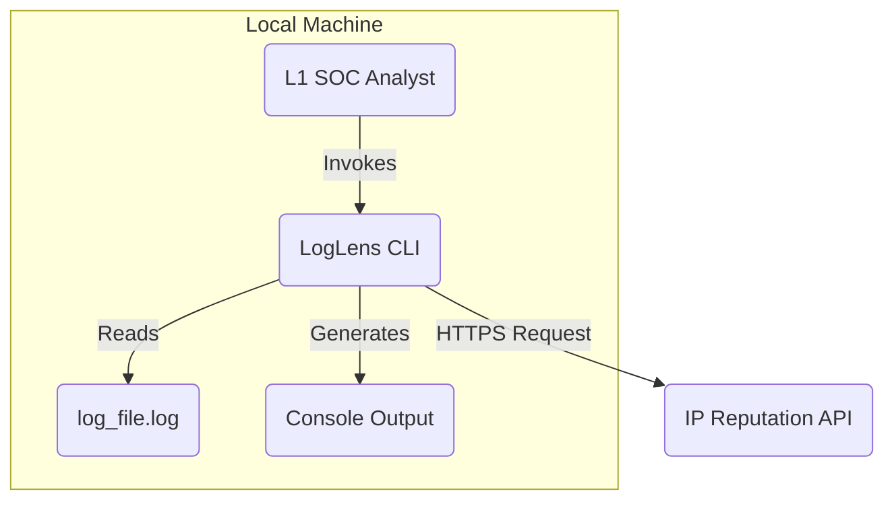
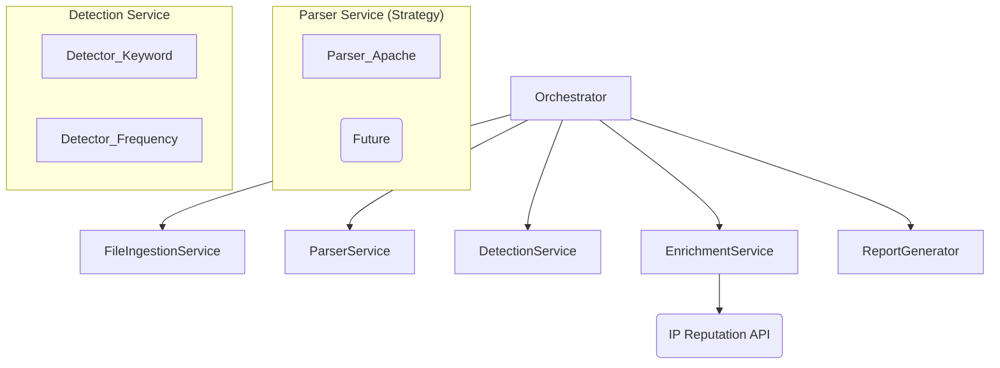
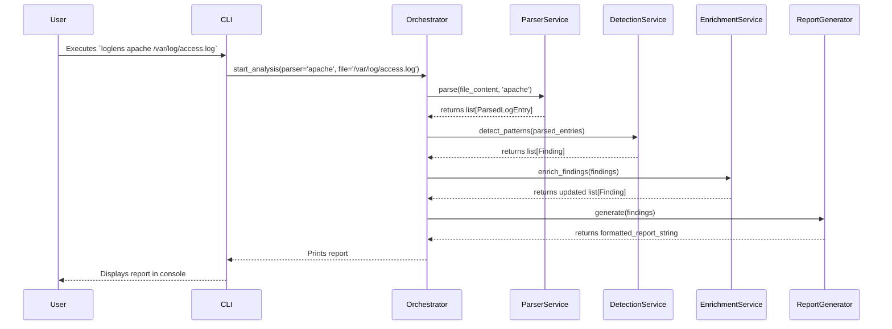

# LogLens Architecture Document

## Introduction / Preamble

This document outlines the overall project architecture for LogLens, a local CLI tool designed to help SOC analysts quickly identify malicious behavior in server logs. It covers the system's components, technology stack, and design principles. Its primary goal is to serve as the guiding architectural blueprint for development, ensuring consistency and adherence to chosen patterns and technologies.

## Table of Contents

  * Introduction / Preamble
  * Technical Summary
  * High-Level Overview
  * Architectural / Design Patterns Adopted
  * Component View
  * Project Structure
  * API Reference
  * Data Models
  * Core Workflow / Sequence Diagrams
  * Definitive Tech Stack Selections
  * Infrastructure and Deployment Overview
  * Error Handling Strategy
  * Coding Standards
  * Overall Testing Strategy
  * Security Best Practices

## Technical Summary

LogLens is a standalone, command-line Python application architected as a modular monolith. It operates by ingesting a single log file, processing it through a series of specialized components—including a pluggable parsing service, a detection engine, and an external API enrichment service—and generating a prioritized, text-based summary report. The architecture prioritizes simplicity, modularity for future expansion (especially for new log formats), and performance to meet the rapid triage goals outlined in the PRD.

## High-Level Overview

The architectural style is a **Monolith**, as the entire functionality is packaged into a single, cohesive CLI application. The repository structure will be a **Monorepo**.

The primary user interaction flow is simple:

1.  The L1 SOC Analyst invokes the tool via their terminal, providing a path to a log file.
2.  LogLens processes the file internally, making external calls only to an IP reputation API for data enrichment.
3.  A formatted summary of findings is printed directly to the analyst's console.

<!-- end list -->



## Architectural / Design Patterns Adopted

To ensure a clean and maintainable codebase, the following patterns will be central to the design:

  * **Strategy Pattern:** This will be used to select the appropriate log parser at runtime (e.g., `ApacheParser`, `NginxParser`) based on user input. This makes the parsing system pluggable and easy to extend.
  * **Adapter (or Facade) Pattern:** An adapter will be created to encapsulate all interactions with the external IP reputation service. This isolates the external dependency, making it easy to swap out services or add new ones in the future, and simplifies how the rest of the application interacts with it.
  * **Modular/Plugin Pattern:** The entire system for both parsers and detection logic will be treated as a plugin system. New parsers or detection rules can be added as new modules without altering the core orchestration logic.

## Component View

The application is broken down into several logical components, each with a single responsibility:

  * **CLI Handler:** The user-facing entry point. Responsible for parsing command-line arguments and flags (e.g., file path, parser type, verbose mode).
  * **Orchestrator:** The central controller that manages the overall workflow, calling other components in the correct sequence.
  * **File Ingestion Service:** Responsible for reading and validating the input log file.
  * **Parser Service:** A service that uses the Strategy pattern to select and run the correct log parser on the file content, transforming raw text into structured data.
  * **Detection Service:** Scans the structured data for suspicious patterns using a collection of detector modules (e.g., `KeywordDetector`, `FrequencyDetector`).
  * **Enrichment Service:** The adapter that takes findings, extracts unique IP addresses, and queries the external reputation API to add context.
  * **Report Generator:** Takes the final, enriched findings and formats them into the human-readable summary report for console output.

<!-- end list -->



## Project Structure

The project will follow a standard Python application structure.

```plaintext
loglens/
├── .github/
│   └── workflows/
│       └── main.yml
├── docs/
│   ├── PRD.md
│   └── architecture.md
├── scripts/
│   └── manual_test_cases.sh
├── src/
│   └── loglens/
│       ├── __init__.py
│       ├── main.py             # CLI Handler & Orchestrator
│       ├── services/
│       │   ├── __init__.py
│       │   ├── parsing/        # Parser Service & Strategies
│       │   │   ├── __init__.py
│       │   │   ├── base_parser.py
│       │   │   └── apache_parser.py
│       │   ├── detection.py    # Detection Service
│       │   ├── enrichment.py   # Enrichment Service
│       │   └── reporting.py    # Report Generator
│       ├── models.py           # Pydantic Data Models
│       └── core/
│           └── config.py       # Configuration management (e.g., API keys)
├── tests/
│   ├── __init__.py
│   ├── test_parsing.py
│   └── test_detection.py
├── .gitignore
├── pyproject.toml              # Project metadata and dependencies (Poetry/Flit)
└── README.md
```

### Key Directory Descriptions

  * **docs/**: Contains all project documentation, including the PRD and this Architecture Document.
  * **src/loglens/**: Contains the main application source code.
  * **src/loglens/services/**: Core business logic, separated into modules for each major function (parsing, detection, etc.).
  * **src/loglens/models.py**: Defines the core Pydantic data models used throughout the application.
  * **tests/**: Contains all automated tests, mirroring the `src` structure.

## API Reference

### External APIs Consumed

#### AbuseIPDB API

  * **Purpose:** To enrich suspicious IP addresses with threat intelligence context.
  * **Base URL(s):** `https://api.abuseipdb.com/api/v2/`
  * **Authentication:** API Key sent in the `Key` header. Key will be stored in an environment variable (`ABUSEIPDB_API_KEY`).
  * **Key Endpoints Used:**
      * **`GET /check`**:
          * Description: Retrieves information and reputation score for a given IP address.
          * Request Parameters: `ipAddress` (string), `maxAgeInDays` (integer, e.g., 90)
          * Success Response Schema (Code: `200 OK`):
            ```json
            {
              "data": {
                "ipAddress": "1.2.3.4",
                "countryCode": "US",
                "abuseConfidenceScore": 95,
                "isTor": false
              }
            }
            ```
          * Note: The actual schema is more complex; this is the subset of data we will use.
  * **Rate Limits:** Free tier has a limit of 1,000 requests per day. The application must be mindful of this.
  * **Link to Official Docs:** `https://docs.abuseipdb.com/`

## Data Models

### Core Application Entities / Domain Objects

#### ParsedLogEntry

  * **Description:** Represents a single, structured log line after parsing.
  * **Schema / Interface Definition:**
    ```python
    # Using Pydantic for validation
    from pydantic import BaseModel, IPAddress
    from datetime import datetime

    class ParsedLogEntry(BaseModel):
        ip_address: IPAddress
        timestamp: datetime
        request_line: str
        status_code: int
        raw_line: str
    ```

#### Finding

  * **Description:** Represents a single suspicious event detected in the logs.
  * **Schema / Interface Definition:**
    ```python
    from typing import Optional

    class Finding(BaseModel):
        log_entry: ParsedLogEntry
        finding_type: str # e.g., "Keyword Match", "High Frequency"
        description: str # e.g., "Found suspicious keyword 'sqlmap'"
        risk_score: int = 50 # Default risk, to be adjusted
        enrichment_data: Optional[dict] = None
    ```

## Core Workflow / Sequence Diagrams



## Definitive Tech Stack Selections

| Category | Technology | Version / Details | Description / Purpose | Justification (Optional) |
| :--- | :--- | :--- | :--- | :--- |
| **Languages** | Python | 3.11+ | Primary language for the entire application. | As required by PRD. Modern versions ensure access to latest features. |
| **Frameworks** | Typer | Latest | CLI framework for creating a user-friendly command-line interface. | More modern and easier to use than `argparse`, with great autocompletion support. |
| | Pydantic | Latest | Data validation and settings management. | Enforces strict data models for internal consistency and reliable parsing. |
| **Libraries** | httpx | Latest | Asynchronous-capable HTTP client for API calls. | Modern, fast, and supports both sync and async usage if needed later. |
| **Testing** | pytest | Latest | Unit/Integration testing framework. | The de-facto standard for testing in Python; powerful and extensible. |
| | pytest-mock | Latest | `pytest` plugin for mocking objects. | Simplifies mocking during tests. |
| **CI/CD** | GitHub Actions | N/A | Continuous Integration/Deployment. | Tightly integrated with GitHub, easy to set up for linting/testing. |
| **Packaging** | Poetry | Latest | Dependency management and packaging. | Modern tool that simplifies dependency and environment management over `pip` and `venv`. |

## Infrastructure and Deployment Overview

  * **Deployment Strategy:** The application will be packaged as a Python wheel and distributed via **PyPI (Python Package Index)**. This allows for simple installation for users via `pip install loglens`.
  * **CI/CD pipeline:** A GitHub Actions workflow will be configured to run on every push to the `main` branch. It will execute linting (`flake8`), type checking (`mypy`), and run all automated tests (`pytest`). On a tagged release, it will automatically build and publish the package to PyPI.
  * **Environments:** The primary environment is the user's local machine. There are no dev/staging/prod server environments.

## Error Handling Strategy

  * **General Approach:** Use specific, custom exceptions inheriting from a base `LogLensError` class.
  * **Logging:** Use Python's built-in `logging` module. Log messages will be simple text formatted for clarity on the console. Errors will be logged to `stderr`, and normal output to `stdout`.
  * **Specific Handling Patterns:**
      * **File I/O:** `FileNotFoundError` and `PermissionError` will be caught and translated into user-friendly error messages.
      * **Parsing:** The parser will skip malformed lines and log a warning to `stderr` for each one, but will not halt execution unless a configurable threshold of errors is met.
      * **External API Calls:** The `EnrichmentService` will use a `try...except` block to catch `httpx` exceptions (e.g., `ConnectTimeout`, `HTTPStatusError`). On failure, it will log a warning and proceed without enrichment data for that IP.

## Coding Standards

  * **Style Guide & Linter:** `black` for auto-formatting, `flake8` for linting, and `mypy` for static type checking. Configurations will be in `pyproject.toml`.
  * **Naming Conventions:**
      * Variables & Functions: `snake_case`
      * Classes & Types: `PascalCase`
      * Constants: `UPPER_SNAKE_CASE`
      * Files & Modules: `snake_case.py`
  * **Type Safety:** All new code must be fully type-hinted and pass `mypy` checks.

## Overall Testing Strategy

  * **Unit Tests:** Will be written for all services and logic modules using `pytest`. All external dependencies (API calls, file system) will be mocked using `pytest-mock`. Test files will live in the `tests/` directory.
  * **Integration Tests:** A small number of integration tests will verify the orchestration logic, ensuring components work together correctly. These will use real (but test-specific) components where possible, mocking only the file system and external API.
  * **Manual Testing:** The `manual_test_scripts` defined in the PRD will be created as shell scripts in the `/scripts` directory to guide human validation.

## Security Best Practices

  * **Secrets Management:** The `ABUSEIPDB_API_KEY` must not be hardcoded. It will be loaded from an environment variable. The `README.md` will instruct users on how to set this up.
  * **Dependency Security:** The CI pipeline will include a step to scan dependencies for known vulnerabilities (e.g., using `pip-audit`).
  * **Input Sanitization:** While the tool is for analysis, not execution, all data from the external API will be validated against our Pydantic models to prevent unexpected data types from causing issues.