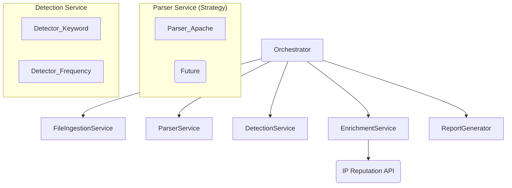

# Component View

The application is broken down into several logical components, each with a single responsibility:

  * **CLI Handler:** The user-facing entry point. Responsible for parsing command-line arguments and flags (e.g., file path, parser type, verbose mode).
  * **Orchestrator:** The central controller that manages the overall workflow, calling other components in the correct sequence.
  * **File Ingestion Service:** Responsible for reading and validating the input log file.
  * **Parser Service:** A service that uses the Strategy pattern to select and run the correct log parser on the file content, transforming raw text into structured data.
  * **Detection Service:** Scans the structured data for suspicious patterns using a collection of detector modules (e.g., `KeywordDetector`, `FrequencyDetector`).
  * **Enrichment Service:** The adapter that takes findings, extracts unique IP addresses, and queries the external reputation API to add context.
  * **Report Generator:** Takes the final, enriched findings and formats them into the human-readable summary report for console output.

<!-- end list -->


