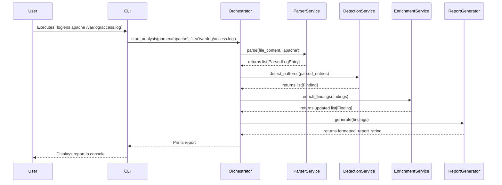

# Core Workflow / Sequence Diagrams

```mermaid
sequenceDiagram
    participant User
    participant CLI
    participant Orchestrator
    participant ParserService
    participant DetectionService
    participant EnrichmentService
    participant ReportGenerator

    User->>CLI: Executes `loglens apache /var/log/access.log`
    CLI->>Orchestrator: start_analysis(parser='apache', file='/var/log/access.log')
    Orchestrator->>ParserService: parse(file_content, 'apache')
    ParserService-->>Orchestrator: returns list[ParsedLogEntry]
    Orchestrator->>DetectionService: detect_patterns(parsed_entries)
    DetectionService-->>Orchestrator: returns list[Finding]
    Orchestrator->>EnrichmentService: enrich_findings(findings)
    EnrichmentService-->>Orchestrator: returns updated list[Finding]
    Orchestrator->>ReportGenerator: generate(findings)
    ReportGenerator-->>Orchestrator: returns formatted_report_string
    Orchestrator-->>CLI: Prints report
    CLI-->>User: Displays report in console
```

