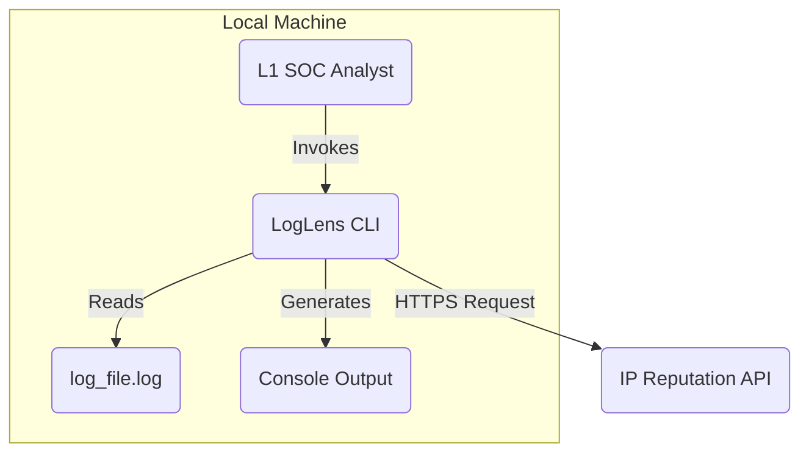

# High-Level Overview

The architectural style is a **Monolith**, as the entire functionality is packaged into a single, cohesive CLI application. The repository structure will be a **Monorepo**.

The primary user interaction flow is simple:

1.  The L1 SOC Analyst invokes the tool via their terminal, providing a path to a log file.
2.  LogLens processes the file internally, making external calls only to an IP reputation API for data enrichment.
3.  A formatted summary of findings is printed directly to the analyst's console.

<!-- end list -->


